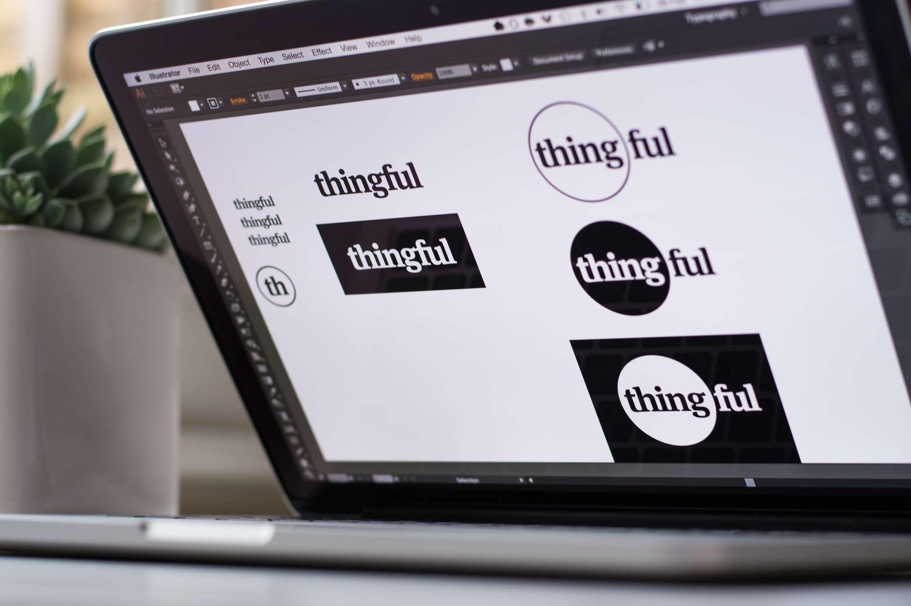
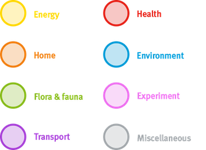
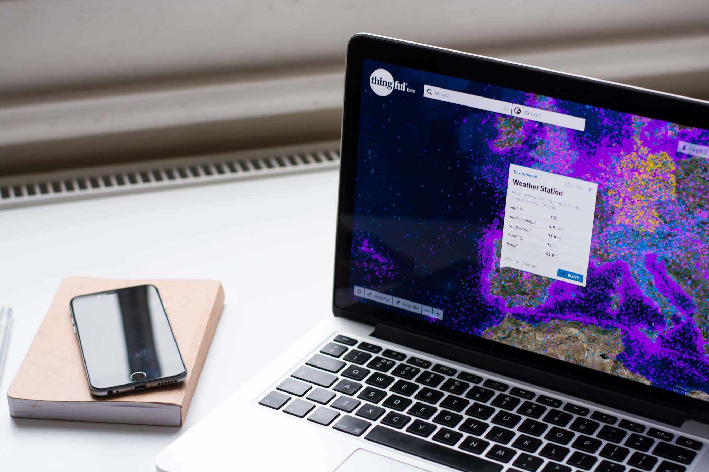
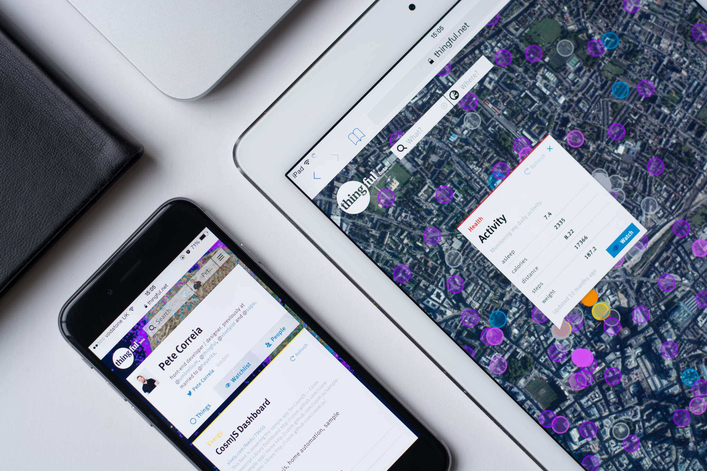

## The First Iteration

It all started in November 2013 when Umbrellium tasked me with creating a map of where all the connected devices of the world are, and what they are. One important initial constraint was we had to do it fast, the goal was to go **from concept to final piece in 1 month**. That’s going from absolutely nothing, other than a grand idea, to something branded, designed and developed in 22 working days with the aid of a backend developer. This was meant to both accelerate the process but also force us to find and focus on the essence of the project.

**The deadline was met** and the first iteration of Thingful was released on December 12th, 2013. It mapped thousands of diverse kinds of public things that were connected to the internet, even unexpected things like sharks and turtles. You could click on things to find out more and have discussions via comments. It was [featured in well-regarded international publications](#press).

## Identity

With only a few days to put together a simple but scalable identity system, this was an intense period. My approach was to focus on **figuring out what the brand should stand for**, what its persona should be.

An important aspect was to **think big** — as big as the idea behind it — which led me away from the standardised branding of technology startups. The identity had to be appealing for the initial tech enthusiasts but at the same time it should not feel distancing or menacing to normal folks who are sensitive to this kind of information being publicly available. I thought the answer was to create an identity system based on values of **trust and clarity**, and guide our ways with a product mission to **help find the humanity in an Internet of Things world**.

The name originated from thinking of adjectives for the product, like meaningful and beautiful. It was a matter of merging those with the subject of the product, the things, so it became Thingful. This seemed to communicate exactly what the product was, full of things.

An interesting fact is that the circle motif which represents every Thing in the map — and that inspired the final revision of the logo — was actually **a consequence of designing both the identity and user interface nearly in tandem**. The circle was not an identity element, it was a solution to the problem of obscuring the specific location of a thing, so that when you zoomed in enough the circle represented the area where the thing is, not the exact point. This became so intensely connected to the aesthetic of the interface that I decided to incorporate it in the identity itself, most importantly in the logo.

As the product evolved, the identity grew to accommodate sub-brands and all the necessary marketing collateral.

## User Experience

I must say, the user experience research and testing relied a lot on the collective experience, instinct and bias of the Umbrellium team and friends. **This isn’t what I preach**, to be frank, as I firmly believe in user research of target users and I’ve relied on that method successfully in other applications I’ve worked on.

**Thingful was a different beast** though, not only did it have very ambitious deadlines and incredible pace but it was also **a pioneering project** in a nascent industry. That meant little to no time for organising user testing, leading me to improvise methods that were very informal and unscientific with colleagues and friends but it gave me enough to work with. There was also little information available online regarding the interface patterns we were designing. I relied a lot on understanding analytics and making sure **I tracked as many interactions as I could**, like how deep people zoomed in and how far they panned the map.

This was a first for me, and **I’ve learned a lot from it**. An important takeaway was understanding that sometimes constraints lead you to improvise the user experience research and there are ways to do it. Expanding on the improvised methods is a subject for an entire article I might write some day, meanwhile I recommend reading [this book](http://undercoverux.com/).

**The toughest nut to crack was ontology**. The task was to categorise everything that can potentially be connected to the internet, knowing already that odd things like sharks and turtles were part of that, and also that the future could bring even more uncommon stuff. The amount of categories was a crucial constraint, there were to be seven at most so that they’d be easy to memorise. I must say that Usman Haque’s contribution here was absolutely key and the ontology we came up with has stood the test of time.

One of the last things I explored was the **anthropomorphisation (personification) of the Things** for the potential that might hold as a different means of communication and interaction. I created a prototype cross-platform mobile application called Contextful that used geolocation and natural language to let you know what Things around you have to say for themselves as you walk down the street. It was incredible to experience this — a bike-share station who shouts at you that it hasn’t been used as you walk by it, or a Raspberry Pi that is very friendly and knows that it’s a famous credit-card sized computer somewhere in a building. It was an interaction model strictly based on human (not machine) communication and it felt **deeply engaging**.

## User Interface

We instinctively knew right from the start that we wanted Thingful to look like the real world, and we wanted it to be about people, not only things. We wanted users to be able to **mentally bridge the digital and physical world** as they explored the Internet of Things — when you looked at your neighbourhood, the roads would have their unique cracks, there’d be the same shape of the trees, and there’d be a bunch connected devices you never thought could be there. This was one of the pillars guiding the user interface design and had the **biggest impact** in the decisions I made along the way.

As the interaction was briefed to be through a map, we thought satellite imagery would be ideal to convey that concept. We knew the trade-offs of doing so, as it’s not as easy to navigate the world like that but it wasn’t the goal of Thingful. This wasn’t to be a replacement of Google Maps but rather **an uncovering of a new layer of our world**. Another detail was that the map should be slowly panning as it does in reality. I’ll cover the technical difficulties of the interface later in the development section of this study.

One of the biggest design challenges was **figuring out how to represent the things themselves**, as there were many kinds and, well, hundreds of thousands of them in one map. The representation I chose was intentionally very abstract — using a coloured semi-opaque bordered circle — because when experimenting with using icons, it was obvious that there were far too many different things to represent and it would be hard to grasp their meaning. Instead, I thought the differentiator could be colour-coded categories, where you’d know the type of thing rather than its exact look. This worked well in understanding the classifications and was less overwhelming on the eyes and memory.

> We didn’t hide anything at all at any screen size, and all the functions of the interface are available for all devices that support them.

Another controversial decision was not to cluster the circles, as many busy maps do, with a number as the density increased. I believe while this is beneficial for a numeric interpretation of density, it didn’t feel dense. **Allowing it to look chaotic** helped drive home the truthful fact there are many, many connected things — the Internet of Things is not coming, it’s here today.

As for making it about people, where this is more obvious is on the pages we generate for each of the things, where there are further details and a discussion space. The striking difference is the ordering of elements with the first one being the owner of the thing. This was quite important as it **centralised the things around the person behind them**, and that was solidified when we introduced user profiles with all of the owned things.

We also knew the application had to be tailored for use in all contexts and screen sizes, it was **designed to be responsive, right from the start**. We didn’t hide anything at all at any screen size, and all the functions of the interface are available for all devices that support them. This was achieved by a highly modular design system based on the now well-known paradigm of cards. The card metaphor is useful for interfaces that have a lot of self-containing entities, like Thingful, while being very flexible and easy to grasp for users.

The user interface I designed is currently part of a **US Patent Pending**, where I'm included as one of the inventors.

## Frontend Development

I learned a wide range of skills developing this application, from things like **geographic information systems** to trying out an **event-based pattern** in Javascript without a framework. Working alone on the frontend development of Thingful helped me learn from first-hand experience the challenges of a fast-growing complex web application.

One of the first major obstacles was **how to place hundreds of thousands of things on a map** and not kill the browser. It’s not at all possible using DOM elements as you might know, there’s just no way you can hold and draw that many elements and be performant.

> Thingful was fully responsive, with all user interface elements and functionalities available to all screen sizes and presented in the most appropriate way.

We had to look at other possible solutions and we found **CartoDB**, which creates map tiles server-side that carry all the elements you want in the image and tracks their locations client-side to allow interactions like clicking and hovering. It works really well, and there’s no other way we found of pulling it off so we had to run with it. Initially we relied on fully on their servers and their full Javascript library but **we increasingly had to start to lift our own weight** as functionality became very specific to our needs. If I were to do it again, I’d essentially grab just the core module of their Javascript library and build out the rest myself.

The application required a lot heavy-lifting from Javascript and unfortunately couldn’t run without it. This troubled me as **I believe in making applications as accessible as possible**, where you layer Javascript on top, following an idea of progressive enhancement. While that was a requirement for the minimum viable experience, all of the other functionalities were **loaded progressively through feature detection** to allow for everyone to use the product to the maximum of their device’s capabilities.

Thingful was fully responsive, with **all user interface elements and functionalities available to all screen sizes** and presented in the most appropriate way. This was baked in from the start using the power of SASS, nested media queries, and SVG / icon fonts for all the re-usable visual assets. As the application grew in size and complexity, following a slightly tweaked version of the Atomic Design structure really helped with maintenance and expansion of the interface.

A daunting task was **finding the right combination of mapping services** to make this application not only as cheap as possible, but also using open-source or community driven projects. I found that Leaflet.js was an incredible asset in this respect, it’s a really well done and complete library for mapping that any website with an interactive map should use. We used Esri for satellite tiles which are free as long as you provide the correct attributions. A tough obstacle was creating a way to provide fallback images for missing tiles because Esri doesn’t provide tile resampling, but other than that the service worked very well.

In terms of **programming approach**, initially it was a sort of spaghetti mess due to how quickly this application had to come to life. I quickly ran into the usual asynchronicity issues, and whenever there was a new sprint I just steered towards **using events**. It started to work really well when I finally abstracted all cards to a single entity and it made things much quicker after that. I didn’t use a framework at the time, but I would definitely use one now as this project would’ve benefited immensely from Angular, Backbone, etc.

> All in all, this was an incredible endeavour that pushed my knowledge and skills in every direction, from concept to experience, interface and finally development.

## Awards & Exhibitions

- [**Runner-up in Social Impact Potential** / Internet of Things Awards 2013](http://postscapes.com/internet-of-things-award/winners/)
- [**Big Bang Data 2014 Exhibition** / Barcelona](http://bigbangdata.cccb.org/en/sec-exhibition/)

## Press

- [**Wired** / Wired’s Connective iPad / Kindle special IoT publication](http://blog.thingful.net/post/85811252571/thingful-in-wireds-connective-ipad-kindle)
- [**Harvard Business Review** / The Internet of Things Is More than Just a Bunch of Refrigerators](https://hbr.org/2014/10/the-internet-of-things-is-more-than-just-a-bunch-of-refrigerators/)
- [**New Scientist** / Thingful site brings linked Internet of Things to life](http://www.newscientist.com/article/dn24771-thingful-site-brings-linked-internet-of-things-to-life.html)
- [**GigaOm** / Thingful upgrades its search engine for the internet of things](https://gigaom.com/2014/10/01/thingful-upgrades-its-search-engine-for-the-internet-of-things/)
- [**Co.Create** - This search engine for The Internet of Things promises to make data more meaningful to people](http://www.fastcocreate.com/3030496/indexing-the-internet-of-things-thingful-promises-to-make-data-meaningful-to-people)
- [**PSFK** / A Search Engine For The Internet Of Things](http://www.psfk.com/2013/12/thingful-search-internet-things.html)
- [**GigaOm** / Why Thingful sees respect for data owners’ wishes as key to internet of things development](https://gigaom.com/2014/10/21/why-thingful-sees-respect-for-data-owners-wishes-as-key-to-internet-of-things-development/)